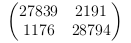

Установление видимости между точками на двумерных ландшафтках с помощью сверточных нейронных сетей.  
Оценка качества сети:  
Confusion matrix:

val accuracy: 0.9438833333333333 
Точность: 0.9292883653380668$ 
Полнота: 0.9607607607607608 
F1: 0.9447625297350505 

